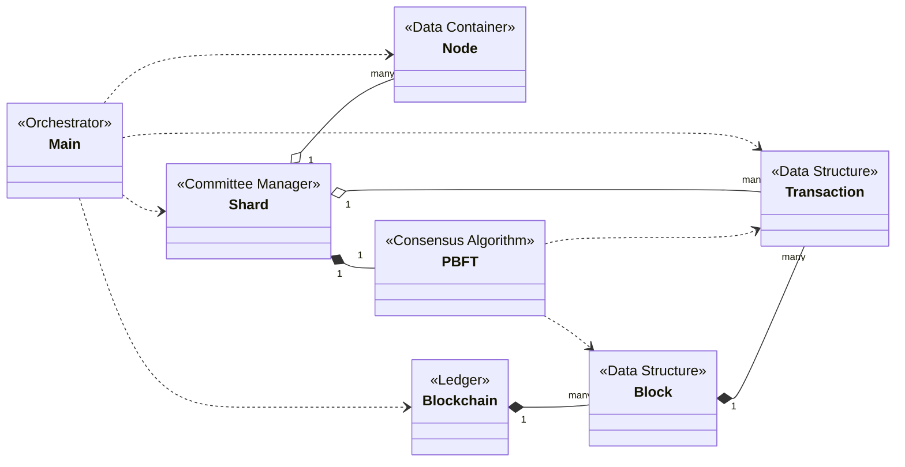

# Deep Dive: Parallelizing Blockchain Computations

This document provides an exhaustive, byte-level explanation of the "Parallelizing Blockchain Computations" project. It synthesizes information from the project's documentation and source structure to offer a complete and in-depth understanding of its architecture, algorithms, and implementation, including correctness arguments, performance analysis, and failure modeling.

---

## 1. Core Problem & Project Goal

### The Problem: The Blockchain Bottleneck

Traditional blockchains operate on a **sequential, single-threaded model**. Every node must process every transaction, leading to:

1.  **Low Throughput:** Insufficient transactions per second (TPS) for large-scale applications.
2.  **High Latency:** Long confirmation times for transactions.
3.  **Poor Scalability:** Performance degrades as user load increases.

### The Goal: Achieving Parallelism with Sharding

This project implements **sharding** to solve the scalability problem. The core idea is to **divide and conquer**:

1.  **Partition the Network:** The network is split into smaller, independent groups of nodes called **shards** or **committees**.
2.  **Partition the Workload:** Transactions are divided among these shards.
3.  **Parallel Consensus:** Each shard runs its own consensus algorithm (**Practical Byzantine Fault Tolerance - PBFT**) in parallel.
4.  **Aggregate the Results:** A **Final Committee** collects the validated blocks from each shard and assembles the final, unified blockchain.

This approach aims to demonstrate a **near-linear increase in transaction throughput** as the number of shards increases.

---

## 2. Foundational Concepts Explained

### A. Message Passing Interface (MPI)

MPI is the backbone of this simulation, perfectly modeling a distributed network where each MPI process represents a single blockchain node.

-   **Key MPI Concepts Used:**
    -   **`MPI_Process`**: `1 MPI Process = 1 Blockchain Node`.
    -   **`MPI_Comm` (Communicator)**: A group of processes. The project uses `MPI_COMM_WORLD` (all nodes) and splits it into smaller communicators for each shard (`shard_comm`) and the final committee (`final_comm`), isolating communication.
    -   **`MPI_Rank`**: A process's unique ID within a communicator.
    -   **Communication Patterns:**
        -   **Point-to-Point (`MPI_Send`, `MPI_Recv`)**: For direct messages.
        -   **Collective (`MPI_Bcast`, `MPI_Allgather`)**: For group communication within a communicator, essential for PBFT's voting phases.

### B. Practical Byzantine Fault Tolerance (PBFT)

PBFT is the chosen **consensus algorithm**, designed to work in systems where some nodes might be faulty or malicious (Byzantine faults).

-   **Key Properties:**
    -   **Safety:** The algorithm never agrees on conflicting values.
    -   **Liveness:** The algorithm eventually agrees on a value.
    -   **Fault Tolerance:** It can tolerate up to `f` Byzantine faulty nodes in a committee of size `N`, where `N >= 3f + 1`.
-   **The Three-Phase Protocol:**
    1.  **`PRE-PREPARE`**: The leader ("primary") proposes a block of transactions.
    2.  **`PREPARE`**: Replicas validate the proposal and broadcast a `prepare` vote. A node waits until it has received `2f` matching `prepare` messages from others. This state is called **prepared**.
    3.  **`COMMIT`**: Once "prepared," a node broadcasts a `commit` vote. It waits until it has collected `2f + 1` matching `commit` messages. At this point, the block is **committed** and considered final.

    Crucially, all `prepare` and `commit` messages include the cryptographic digest (hash) of the proposed block. A replica will only accept messages that match the digest from the initial `pre-prepare` message, ensuring all honest nodes are voting on the exact same proposal.

---

## 3. System Architecture & Component Deep Dive

This section breaks down each C++ class and its role in the simulation.

### `main.cpp` - The Orchestrator
The entry point of the simulation.
1.  **MPI Initialization & Configuration**: Initializes MPI and broadcasts the `ExperimentConfig` struct to all nodes.
2.  **Network Partitioning**: Uses `MPI_Comm_split` to partition nodes into `N` shard communicators and one final committee communicator.
3.  **Transaction Generation & Distribution**: The root process generates mock transactions and distributes them to shard leaders.
4.  **Execution & Timing**: The root process times the end-to-end process, from distribution to finalization.

### `node.h` / `node.cpp` - The Network Participant
A data class holding a node's state: `global_rank`, `shard_id`, `shard_rank`, and `role` (e.g., `SHARD_MEMBER`, `FINAL_COMMITTEE_MEMBER`).

### `transaction.h` / `transaction.cpp` - The Unit of Work
Defines the `Transaction` data structure (`id`, `sender`, `receiver`, `amount`).
-   **Serialization**: This is a critical feature for MPI communication.
    -   **Implementation**: The class must provide `serialize()` and `deserialize()` methods. A robust implementation would handle variable-size fields and endianness. While manual byte packing is possible, using `MPI_Pack` and `MPI_Unpack` is safer as it abstracts away buffer management and alignment.
    -   **Overhead**: Serialization/deserialization is a non-trivial CPU cost and a primary source of overhead. The choice of format (e.g., fixed-size binary vs. a text-based format like JSON) has significant performance implications.

### `shard.h` / `shard.cpp` - The Parallel Unit
Manages a single shard, holding its `MPI_Comm`, transaction pool, and a `PBFT` instance. It orchestrates the consensus process within its shard and sends the resulting block to the final committee.

### `pbft.h` / `pbft.cpp` - The Consensus Engine
The implementation of the three-phase PBFT protocol, managing the state machine (`NEW`, `PRE-PREPARED`, `PREPARED`, `COMMITTED`) for each node.

### `block.h` / `blockchain.h` / `blockchain.cpp` - The Ledger
-   **`Block` Data Structure**:
    -   **Header**: Contains `height`, `timestamp`, and `previous_hash`.
    -   **Transactions**: A list of `Transaction` objects.
    -   **Hashing**: A cryptographic hash (e.g., **SHA-256**) is computed over the block's contents. For efficiency and verifiability, a **Merkle Tree** should be used to hash the transactions. The Merkle root is then included in the block header and becomes part of the overall block hash. This allows for lightweight verification of transaction inclusion without needing the full transaction list.
-   **`Blockchain` Class**: Manages the final, global chain as a `std::vector<Block>`, used primarily by the Final Committee.

### `final_committee.h` / `final_committee.cpp` - The Aggregator
This component creates the canonical blockchain from the parallel work of the shards.
-   **Consensus Model**: In its simplest form, the Final Committee operates in a **single-leader model**. The leader (e.g., rank 0 of the final committee communicator) gathers all shard blocks and orders them deterministically (e.g., by shard ID). This is a **centralized bottleneck** and a single point of failure.
-   **Correctness Guarantees**: This simple model does not provide fault tolerance for the finalization step. A misbehaving shard leader could submit a bad block, or the final committee leader could fail.
-   **Robust Alternative**: A production-grade system would require the Final Committee to **also run a consensus protocol (like PBFT)** to agree on the set and order of incoming shard blocks. This would make the finalization process itself fault-tolerant but would add significant communication overhead. For this project, the single-leader model is assumed for simplicity.

---

## 4. Correctness, Fault Tolerance, and Network Assumptions

### A. Fault Model and Simulation
-   **Simulating Byzantine Faults**: The current simulation model assumes all nodes are **honest-but-curious**. They follow the protocol correctly. To simulate Byzantine faults, specific MPI ranks would be programmed to exhibit malicious behavior:
    -   **Crash Fault**: The process calls `MPI_Finalize` and exits prematurely.
    -   **Equivocation**: A faulty leader sends different `pre-prepare` messages (e.g., with different transaction orders) to different replicas.
    -   **Message Dropping**: A faulty node deliberately fails to broadcast or send messages.
    -   **Invalid Messages**: A node sends corrupted or improperly signed messages.
    Implementing these is out of scope for the initial project but is essential for validating the robustness of the PBFT implementation.

-   **Node Failure Detection**: In this simulation, the failure of an MPI process is a catastrophic event that typically causes `MPI_Abort` to terminate the entire run. The model does not handle dynamic node crashes and recoveries. The PBFT `view-change` protocol is designed to handle leader failures, but its implementation is complex and often omitted in initial proofs of concept.

### B. Shard Safety and Fault Thresholds
-   **Shard Size**: The number of nodes per shard is determined by `(world_size - final_committee_size) / num_shards`.
-   **Fault Threshold `f`**: The `faulty_nodes_per_shard` parameter (`f`) is set in the configuration. For PBFT to be safe, each shard must have at least `N = 3f + 1` nodes. This means the smallest possible shard size for tolerating one faulty node (`f=1`) is **4**. If a shard has fewer than `3f+1` nodes, it cannot guarantee safety or liveness in the presence of `f` faults.

### C. Formal Correctness Argument: From Local to Global Consistency

The guarantee of global consistency for the entire sharded blockchain rests on two core premises: the correctness of PBFT within each shard and the deterministic nature of the final aggregation.

1.  **Premise 1: Intra-Shard Liveness and Safety.** The PBFT protocol guarantees that for any given shard operating with `N >= 3f + 1` nodes, all honest replicas will agree on a single, totally ordered sequence of transaction blocks. They will never commit conflicting blocks at the same height (Safety), and they will eventually commit the next block in the sequence (Liveness). This establishes a consistent and final history *local to each shard*.

2.  **Premise 2: Deterministic Aggregation.** The Final Committee is defined to operate deterministically. For any given global block height, it waits to receive one valid block from each shard leader. It then assembles these blocks into a final chain using a fixed, publicly known ordering rule (e.g., sorting by `shard_id`). There is no ambiguity in this step.

**Conclusion: Global Consistency.** Because every shard produces a single, provably consistent local history (Premise 1), and the Final Committee combines these consistent histories in a globally deterministic and unambiguous way (Premise 2), it follows that all honest nodes in the entire system will reconstruct the exact same global blockchain state. This two-level process effectively transforms the local finality of each shard into the global finality of the entire system.

### D. Network Model Assumptions
-   **Synchrony**: The model assumes a **weakly synchronous** network, where messages are guaranteed to be delivered within some bounded (but unknown) time. This is a standard assumption for PBFT.
-   **Message Delivery**: The simulation relies on MPI, which provides **guaranteed, ordered message delivery** for point-to-point communication. This is a stronger guarantee than in real-world IP networks, where packets can be lost, duplicated, or reordered.

---

## 5. Inter-Shard Communication and Transactions

-   **Cross-Shard Transactions**: This simulation makes a simplifying assumption: all transactions are contained within a single shard. The root process pre-partitions transactions accordingly.
-   **Why this is a simplification**: Real-world applications require cross-shard transactions (e.g., a user in shard A sending funds to a user in shard B).
-   **Handling Cross-Shard Transactions**: Supporting them would require a complex protocol, such as a **two-phase commit (2PC)**, to ensure atomicity. The transaction would need to be "prepared" in the source shard and "committed" in the destination shard, with a coordinating mechanism to ensure it either completes in both or is aborted in both. This is a significant research challenge and is considered out of scope.

---

## 6. Communication Complexity and Performance Bottlenecks

### A. PBFT Message Complexity
The communication cost of PBFT within a single shard of size `N` is dominated by the all-to-all broadcast nature of the `prepare` and `commit` phases.
-   In each phase, each of the `N` nodes sends a message to all `N-1` other nodes.
-   This results in **O(N²) message complexity per consensus round**. This cost means that while sharding allows for parallelism *across* shards, the size of individual shards is a critical performance parameter. Very large shards will suffer from high internal communication overhead.

### B. MPI Communication Costs
-   **`MPI_Bcast`**: Typically implemented with a tree-based algorithm, costing **O(log N)** time.
-   **`MPI_Allgather`**: Requires each of the `N` processes to receive data from all others, costing **O(N log N)** or **O(N)** depending on the implementation and message size.
-   These collective operations introduce synchronization points, where faster nodes must wait for slower ones, adding to latency.

### C. Expected Performance Bottlenecks
1.  **The Final Committee**: As the single point of aggregation, this is the primary serial bottleneck. Its existence limits the maximum achievable speedup, a classic example of **Amdahl's Law**.
2.  **Intra-Shard `O(N²)` Messaging**: As shard sizes grow, the cost of PBFT consensus will eventually dominate the computation time, limiting the benefits of adding more nodes to a shard.
3.  **Serialization Overhead**: The CPU cost of packing and unpacking `Transaction` objects into byte buffers for MPI can be significant, especially with large transaction batches.

---

## 7. Execution Timeline and Object Lifecycle

A typical execution flow for a single round of consensus:
1.  **`main()`**: `MPI_Init` is called.
2.  **Setup**: The root process broadcasts the configuration. `MPI_Comm_split` is called by all processes, creating shard and final committee communicators. `Node`, `Shard`, and `PBFT` objects are constructed.
3.  **Distribution**: The root process generates and scatters transactions to the shard leaders.
4.  **Parallel Consensus (Concurrent Execution)**:
    -   Each `Shard` leader receives its transactions.
    -   Each `Shard` object calls `pbft_instance.executeConsensus()`.
    -   Inside `PBFT`, the leader `MPI_Bcast`s a `pre-prepare` message on its `shard_comm`.
    -   Replicas use `MPI_Allgather` on `shard_comm` to exchange `prepare` and `commit` votes.
    -   This happens in all shards simultaneously.
5.  **Aggregation**:
    -   Each shard leader, upon successful consensus, sends its new `Block` to the final committee leader via `MPI_Send`.
    -   The final committee leader uses `MPI_Recv` in a loop to collect one block from each shard leader.
6.  **Finalization**: The final committee leader assembles the blocks into the global `Blockchain`.
7.  **Timing**: The root process stops the timer and reports the total time.
8.  **Teardown**: Objects are destructed, and `MPI_Finalize` is called.

---

## 8. Experiment Methodology and Performance Theory

### A. Scientific Rigor
To ensure statistically valid results, the methodology must include:
-   **Multiple Trials**: Each experiment configuration (e.g., 8 shards, 10k transactions) must be run multiple times (e.g., 5-10 trials) to compute the mean and standard deviation of performance metrics.
-   **Parameter Documentation**: All runs must log the exact configuration: total nodes, shard count, nodes per shard, `f`, transaction count, and hardware used (`kraken` cluster specifications).
-   **Error Bars**: Performance graphs (TPS, Latency) must include error bars to visualize the variance across trials.

### B. Theoretical Performance Limits
-   **Amdahl's Law**: The speedup of a parallel program is limited by its serial portion. In this project, the initial transaction distribution and the final block aggregation by the Final Committee are serial bottlenecks. As the number of shards (`N`) approaches infinity, the maximum speedup is capped by `1 / (serial_fraction)`.
-   **Gustafson's Law (Weak Scaling)**: This law suggests that instead of doing the same work faster (strong scaling), one can use more processors to do more work in the same amount of time. For this project, it means that if we double the number of shards, we should be able to process double the number of total transactions in roughly the same time, assuming the system scales well.