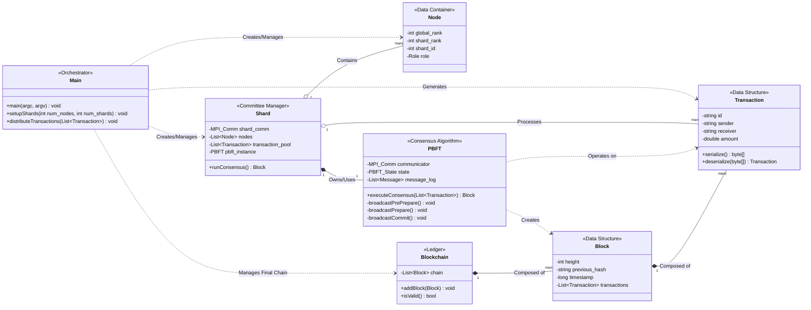

# Deep Dive: Parallelizing Blockchain Computations

This document provides an exhaustive, byte-level explanation of the "Parallelizing Blockchain Computations" project. It synthesizes information from the project's documentation (`PROPOSAL.md`, `STRUCTURE.md`, `IMPLEMENTATION_PLAN.md`, etc.) and the conceptual C++/MPI source structure to offer a complete and in-depth understanding of its architecture, algorithms, and implementation.

---

## 1. Core Problem & Project Goal

### The Problem: The Blockchain Bottleneck

Traditional blockchains like Bitcoin operate on a **sequential, single-threaded model**. Every node in the network must process every transaction to validate it and add it to the ledger. This results in several critical limitations:

1.  **Low Throughput:** The number of transactions the network can process per second (TPS) is severely limited. For example, Bitcoin processes about 7 TPS, and Ethereum around 15-30 TPS. This is insufficient for large-scale applications like global payment systems or high-frequency trading.
2.  **High Latency:** The time it takes for a transaction to be considered final (i.e., immutably recorded on the chain) can be long, often minutes or even hours.
3.  **Poor Scalability:** As more users join the network, the transaction load increases, but the processing capacity remains fixed, leading to network congestion and higher transaction fees.

### The Goal: Achieving Parallelism with Sharding

This project aims to solve the scalability problem by implementing **sharding**, a database partitioning technique adapted for blockchains.

**The core idea is to divide and conquer:**

1.  **Partition the Network:** Instead of one monolithic network where every node does the same work, the network is split into smaller, independent groups of nodes called **shards** or **committees**.
2.  **Partition the Workload:** The global set of transactions is also divided among these shards. Each shard is only responsible for processing its own subset of transactions.
3.  **Parallel Consensus:** Each shard runs its own consensus algorithm (in this case, **Practical Byzantine Fault Tolerance - PBFT**) in parallel with all other shards. This means multiple blocks of transactions are created and validated simultaneously.
4.  **Aggregate the Results:** A special committee, the **Final Committee**, collects the validated blocks from each shard and assembles them into the final, unified blockchain.

By doing this, the project aims to demonstrate a **near-linear increase in transaction throughput** as the number of shards increases, proving that parallel computing principles can effectively address the blockchain scalability bottleneck.

---

## 2. Foundational Concepts Explained

### A. Message Passing Interface (MPI)

MPI is the backbone of this simulation. It's a standardized library for writing parallel programs where processes communicate by sending and receiving messages.

-   **Why MPI?** It perfectly simulates a distributed network of blockchain nodes. Each MPI process represents a single node, and all communication between nodes (broadcasting transactions, sending consensus votes, etc.) is handled via MPI functions.
-   **Key MPI Concepts Used:**
    -   **`MPI_Process`**: A single running instance of the program. In this project, `1 MPI Process = 1 Blockchain Node`.
    -   **`MPI_Comm` (Communicator)**: A group of processes that can communicate with each other. This is the most critical MPI concept for sharding. The project will use `MPI_COMM_WORLD` (all nodes) and then split it into smaller communicators for each shard (`shard_comm`) and the final committee (`final_comm`). This isolates communication, allowing shards to run consensus without interfering with each other.
    -   **`MPI_Rank`**: A process's unique ID within a communicator.
    -   **Communication Patterns:**
        -   **Point-to-Point (`MPI_Send`, `MPI_Recv`)**: Used for direct messages, like a shard leader sending its final block to the final committee.
        -   **Collective (`MPI_Bcast`, `MPI_Allgather`)**: Used for group communication within a communicator. These are essential for the PBFT algorithm, where a leader broadcasts a proposal (`MPI_Bcast`) and all nodes gather votes from everyone else (`MPI_Allgather`).

### B. Practical Byzantine Fault Tolerance (PBFT)

PBFT is the chosen **consensus algorithm**. It's designed to work in distributed systems where some nodes might be faulty or malicious (Byzantine faults).

-   **Why PBFT?** It's a classic, well-understood algorithm that provides high performance and, crucially, **finality**. Once a block is committed via PBFT, it is final and cannot be reversed. This is a major advantage over probabilistic consensus like Bitcoin's Proof-of-Work.
-   **Key Properties:**
    -   **Safety:** The algorithm will never agree on two conflicting values (e.g., two different blocks at the same height).
    -   **Liveness:** The algorithm will eventually agree on a value, assuming network conditions are stable.
    -   **Fault Tolerance:** It can tolerate up to `f` Byzantine faulty nodes in a network of `N = 3f + 1` total nodes.
-   **The Three-Phase Protocol (The Core of PBFT):**
    1.  **`PRE-PREPARE`**: The leader of a committee (the "primary") receives a client request (a batch of transactions), assigns it a sequence number, and broadcasts a `pre-prepare` message to all other nodes (the "replicas").
    2.  **`PREPARE`**: Upon receiving the `pre-prepare` message, each replica validates it. If it's valid, the replica broadcasts a `prepare` message to all other nodes in the committee. This signals, "I agree with the leader's proposal." A node waits until it has received `2f` matching `prepare` messages from other nodes. This state is called **prepared**.
    3.  **`COMMIT`**: Once a node is "prepared," it broadcasts a `commit` message. This signals, "I have seen proof that a quorum of nodes agrees on this proposal." A node waits until it has collected `2f + 1` matching `commit` messages (including its own). This state is called **committed**. At this point, the transaction block is considered finalized and is executed (added to the shard's local chain).

This three-phase process ensures that a supermajority of honest nodes agree on the order of transactions before anything is made permanent.

---

## 3. System Architecture & Component Deep Dive

This section breaks down each C++ class and its role in the simulation, following the structure defined in `STRUCTURE.md` and the UML diagram.

### `main.cpp` - The Orchestrator
This is the entry point of the simulation. Its sole purpose is to set up and run the entire experiment.
1.  **MPI Initialization**: Calls `MPI_Init` to start the MPI environment. Gets the total number of processes (`world_size`) and the rank of the current process (`world_rank`).
2.  **Configuration**: The root process (rank 0) parses command-line arguments (`--shards`, `--transactions`) into an `ExperimentConfig` struct. This configuration is then broadcast to all other processes using `MPI_Bcast`. This ensures every node works with the same parameters.
3.  **Network Partitioning**: This is the most critical setup step. It uses `MPI_Comm_split` to partition the `MPI_COMM_WORLD` communicator. Each process is assigned a `color` (its `shard_id`) and a `key` (its rank within the shard). All processes with the same `color` are grouped into a new communicator. This creates `N` shard communicators and one final committee communicator.
4.  **Transaction Generation & Distribution**: The root process generates a large pool of mock `Transaction` objects. It then divides this pool into chunks, one for each shard. Using `MPI_Scatter` or point-to-point `MPI_Send`, it sends each shard leader its assigned chunk of transactions.
5.  **Execution & Timing**: The root process starts a timer (`MPI_Wtime`). It then waits for the entire process to complete. Once the final committee has assembled the final block, the root process stops the timer and prints the total execution time. This output is used by `plot_results.py` to calculate performance metrics.

### `node.h` / `node.cpp` - The Network Participant
This is a simple data class. Each MPI process will have a `Node` object to represent itself. It holds state information:
-   `global_rank`: The node's rank in `MPI_COMM_WORLD`.
-   `shard_id`: The ID of the shard it belongs to.
-   `shard_rank`: The node's rank within its shard's communicator. This is important for identifying the shard leader (who is typically `shard_rank == 0`).
-   `role`: An enum indicating its role (e.g., `SHARD_MEMBER`, `FINAL_COMMITTEE_MEMBER`).

### `transaction.h` / `transaction.cpp` - The Unit of Work
Defines the `Transaction` data structure.
-   **Fields**: `id`, `sender`, `receiver`, `amount`.
-   **Serialization**: This is a critical feature. To send a `Transaction` object via MPI, it must be converted into a raw byte buffer. This class will contain `serialize()` and `deserialize()` methods.
    -   `serialize()`: Packs the `id`, `sender`, etc., into a `char*` or `std::vector<char>`.
    -   `deserialize()`: Takes a byte buffer received from MPI and reconstructs the `Transaction` object from it.

### `shard.h` / `shard.cpp` - The Parallel Unit
This class manages a single shard.
-   **Fields**:
    -   `shard_comm`: The `MPI_Comm` for this shard, containing only the nodes of this shard.
    -   `transaction_pool`: The subset of transactions assigned to this shard.
    -   `pbft_instance`: An instance of the `PBFT` class, configured to run within `shard_comm`.
-   **Logic**:
    1.  The shard leader receives transactions from the root process.
    2.  The leader initiates the consensus process by calling `pbft_instance.executeConsensus(transaction_pool)`.
    3.  The `PBFT` logic runs, using `shard_comm` for all its communication. This is what allows all shards to run consensus in parallel without interference.
    4.  Once consensus is reached, the leader receives a validated `Block` from the PBFT module.
    5.  The leader then sends this `Block` (or its header) to the final committee leader.

### `pbft.h` / `pbft.cpp` - The Consensus Engine
This is the implementation of the three-phase PBFT protocol.
-   **State Machine**: The class will manage the state of each node (`NEW`, `PRE-PREPARED`, `PREPARED`, `COMMITTED`).
-   **MPI Communication**:
    -   **Pre-prepare**: The leader uses `MPI_Bcast` within its given communicator to send the proposed block to all replicas in its shard.
    -   **Prepare/Commit**: Replicas need to broadcast their votes and also see everyone else's votes. `MPI_Allgather` is a perfect fit here. A process can place its vote into a buffer, and `MPI_Allgather` will collect the buffers from all processes in the communicator and distribute the combined result back to everyone. This allows each node to independently verify if `2f+1` votes have been cast.
-   **Output**: If consensus is successful, the `executeConsensus` method returns a finalized `Block` object to the caller (the `Shard` manager).

### `block.h` / `blockchain.h` / `blockchain.cpp` - The Ledger
-   `Block`: A data structure containing a list of `Transaction` objects, a block header (previous hash, timestamp), and a cryptographic hash of its own contents.
-   `Blockchain`: A class that manages the final, global chain, likely as a `std::vector<Block>`. It's primarily used by the **Final Committee**. Its main job is to receive blocks from the shards, verify them, and append them to the chain.

### `final_committee.h` / `final_committee.cpp` - The Aggregator
This component is responsible for creating the single, canonical blockchain from the parallel work of the shards.
-   **Logic**:
    1.  The leader of the final committee waits to receive validated blocks from the leader of each shard using `MPI_Recv`.
    2.  As each block arrives, it's added to a temporary pool.
    3.  Once blocks have been received from all shards, the final committee orders them (e.g., by shard ID) and links them together to form the final chain, which is managed by the `Blockchain` class.
    4.  This finalization step signals the end of the simulation for one batch of transactions.

---

## 4. Performance Measurement & Experimentation

The entire purpose of this complex setup is to generate performance data.

### Baseline (Serial) Model vs. Parallel (Sharded) Model

-   **Baseline Run**: The simulation is run with `--shards 1`. All nodes are placed in a single committee (`MPI_COMM_WORLD`) and must process all transactions sequentially. The time taken is `Time_Serial`.
-   **Parallel Run**: The simulation is run with `--shards N` where `N > 1`. The nodes are split into `N` shards, and the workload is divided. The time taken is `Time_Parallel`.

### Key Metrics

The `run_experiment.sh` script automates these runs and logs the output. The `plot_results.py` script then parses this data to calculate:

1.  **Throughput (TPS)**:
    -   `Total Transactions / Time_Parallel(N)`
    -   **Expected Result**: Throughput should increase as `N` (number of shards) increases.

2.  **Latency**:
    -   The total time measured (`Time_Parallel(N)`).
    -   **Expected Result**: Latency for a fixed number of total transactions should decrease as `N` increases.

3.  **Speedup**:
    -   `Time_Serial / Time_Parallel(N)`
    -   **Expected Result**: A value greater than 1, indicating a performance improvement. In an ideal world, speedup would be close to `N`, but communication overhead will reduce this.

---

## 5. Conclusion

This project is a deep and practical exploration of applying parallel computing principles to solve a real-world problem in distributed systems. By meticulously structuring the network into isolated communicators (shards) and running a well-defined consensus protocol (PBFT) within each, the simulation is designed to provide a clear, data-driven answer to the question: "How much faster can a blockchain be if we process transactions in parallel?" The combination of C++ for performance, MPI for network simulation, and a hierarchical sharding architecture provides a powerful framework for studying and quantifying the benefits of parallelization.
