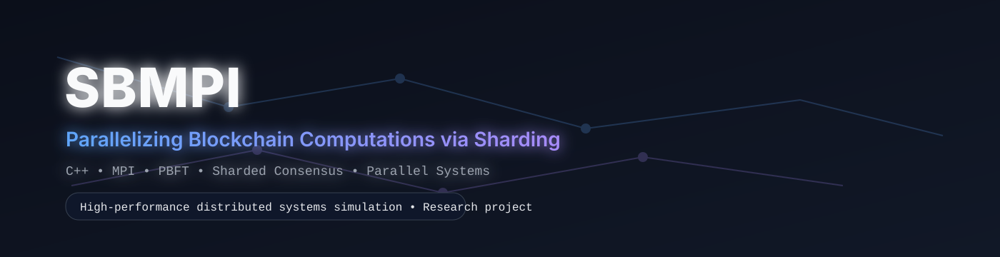

<p align="center">
  
</p>


# ⛓️ SBMPI: Parallelizing Blockchain Computations via Sharding

**A high-performance C++/MPI simulation of a sharded blockchain network using PBFT consensus to achieve horizontal scalability.**

---

## TL;DR

This project implements a **sharded, PBFT-based blockchain simulator** in **C++ using MPI**
to demonstrate how **parallel consensus** improves transaction throughput and latency.

We compare:
- a **serial PBFT baseline**
- against a **parallel sharded architecture**

and show **near-linear throughput scaling** as shard count increases.

---

## Overview

This project addresses the critical scalability bottlenecks found in traditional, sequential blockchain architectures. By implementing a parallel blockchain algorithm using **Sharding** and **Message Passing Interface (MPI)**, the system demonstrates significant improvements in transaction throughput and latency.

### ⚡ Key Value Proposition

* **Horizontal Scalability:** Distributes the transaction load across independent committees (shards).
* **High-Performance Consensus:** Utilizes the **Practical Byzantine Fault Tolerance (PBFT)** algorithm for intra-shard agreement.
* **MPI Integration:** Simulates a true distributed environment where each node is an independent process.
* **Parallel Validation:** Leverages **OpenMP** for multi-threaded signature verification within nodes.

---

## 🏗️ Architecture & Simulation Flow

The network is composed of independent MPI processes, each assigned a specific role to simulate a tiered consensus environment.

### Node Roles

1. **Shard Member:** The workhorse nodes that validate transactions and participate in the 3-phase PBFT consensus protocol.
2. **Shard Leader:** One leader per shard who proposes `MicroBlocks` and initiates the consensus process.
3. **Final Committee Member:** A dedicated group responsible for gathering validated `MicroBlocks` and assembling them into the definitive `MacroBlock` for the global blockchain.

### Lifecycle of a Transaction

* **1. Distribution:** The root process (Rank 0) generates and partitions transactions, sending them to the appropriate **Shard Leaders**.
* **2. Intra-Shard Consensus:** Shards execute the **PBFT protocol** (Pre-Prepare --> Prepare --> Commit) to agree on a `MicroBlock`.
* **3. Finalization:** Shard leaders send committed `MicroBlocks` to the **Final Committee**, which aggregates them into the global chain.

---

## 🛠️ Tech Stack & Dependencies

| Component | Technology | Purpose |
| --- | --- | --- |
| **Language** | C++17 | Performance and low-level resource control. |
| **Networking** | MPI | Simulating distributed message passing between nodes. |
| **Parallelism** | OpenMP | Parallelizing transaction validation within a node. |
| **Cryptography** | `secp256k1` | Industry-standard ECDSA signatures (Bitcoin-grade). |
| **Serialization** | `nlohmann/json` | Modern JSON handling for configurations and state. |

---

## 🚀 Getting Started

### Prerequisites

* **MPI Compiler:** OpenMPI or MPICH.
* **Build System:** CMake (>= 3.16) and Make.
* **Libraries:** OpenSSL.

### Build Instructions

```bash
# Clone the repository
git clone <repo-url>
cd acphotinakis-parallelizing-blockchain-computations

# Build the project
mkdir build && cd build
cmake ..
make -j$(nproc)

```

### Running the Simulation

Execute the simulation using `mpiexec`. The total number of nodes must be at least the sum of shards plus the Final Committee size.

```bash
# Example: 8 nodes, 2 shards, 1000 transactions
mpiexec -n 8 ./sbmpi --shards 2 --transactions 1000

```

---

## Performance Measurement

The simulation generates detailed CSV metrics in the `/metrics` directory, focusing on three core KPIs:

* **Throughput (TPS):** Total transactions finalized per second.
* **Latency:** Average time from submission to final confirmation.
* **Speedup:** Ratio of serial execution time vs. parallel (sharded) execution.

---

## Project Structure

```text
.
├── include/sbmpi/
│   ├── consensus/    # PBFT protocol and message headers
│   ├── core/         # Blockchain, Node, and Block logic
│   ├── network/      # Sharding, MPI wrappers, and committees
│   └── util/         # Logging, Metrics, and Serialization
├── src/              # Implementation files (.cpp)
├── scripts/          # Experiment runners and plotting tools
├── tests/            # PBFT and Sharding integration tests
└── secp256k1/        # Vendored crypto library

```

---

## References

* Amiri, M. J., Agrawal, D., & El Abbadi, A. (2019). "On Sharding Permissioned Blockchains." *2019 IEEE International Conference on Blockchain (Blockchain)*, pp. 282-285. [doi:10.1109/Blockchain.2019.00044]
* Castro, M., & Liskov, B. (1999). "Practical Byzantine Fault Tolerance." *Proceedings of the Third Symposium on Operating Systems Design and Implementation (OSDI)*.
* Hursey, J., & Graham, R. L. (2012). "Analyzing fault aware collective performance in a process fault tolerant MPI." *Parallel Computing*, 38(1), pp. 15-25. [doi:10.1016/j.parco.2011.10.010]
* Luu, L., et al. (2016). "A Secure Sharding Protocol for Open Blockchains (Elastico)." *Proceedings of the 2016 ACM SIGSAC Conference on Computer and Communications Security*.
* Wu, X., Jiang, W., Song, M., Jia, Z., & Qin, J. (2023). "An efficient sharding consensus algorithm for consortium chains." *Scientific Reports*, 13(1), p. 20. [doi:10.1038/s41598-022-27228-1]
* Xu, J., Wang, C., & Jia, X. (2023). "A Survey of Blockchain Consensus Protocols." *ACM Computing Surveys*, 55(13s), pp. 1-35. [doi:10.1145/3579845]
* Yu, G., Wang, X., Yu, K., Ni, W., Zhang, J. A., & Liu, R. P. (2020). "Survey: Sharding in Blockchains." *IEEE Access*, 8, pp. 14155-14181. [doi:10.1109/ACCESS.2020.2965147]
* Zhang, G., Pan, F., Mao, Y., Tijanic, S., Dang’ana, M., Motepalli, S., Zhang, S., & Jacobsen, H. A. (2024). "Reaching Consensus in the Byzantine Empire: A Comprehensive Review of BFT Consensus Algorithms." *ACM Computing Surveys*, 56(5), pp. 1-41. [doi:10.1145/3636553]

---

**License:** This project is for academic simulation and research purposes.