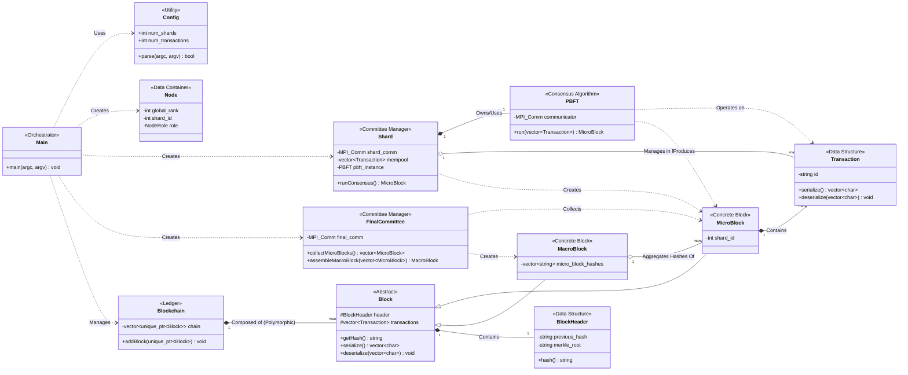

# UML Class Diagram (Updated)

This document contains an updated UML class diagram representing the implemented software architecture. This diagram reflects the more detailed and modular structure of the final codebase.

## Diagram Legend (Updated)

-   **`Main`**: The simulation driver. Uses `Config` to set up the environment, then creates and manages `Shard`s and the `FinalCommittee`.
-   **`Config`**: Parses and holds simulation parameters.
-   **`Node`**: Holds a process's identity and role.
-   **`Transaction`**: A serializable data structure for a single transaction.
-   **`Block`**: Abstract base class for blocks.
-   **`MicroBlock`**: Concrete block produced by a `Shard`. Contains transactions.
-   **`MacroBlock`**: Concrete block produced by the `FinalCommittee`. Contains hashes of `MicroBlock`s.
-   **`BlockHeader`**: Metadata for a `Block`.
-   **`Blockchain`**: The global ledger, composed of a polymorphic list of `Block`s (primarily `MacroBlock`s).
-   **`Shard`**: Manages a shard committee, its `Mempool`, and runs a `PBFT` instance to produce a `MicroBlock`.
-   **`FinalCommittee`**: Manages the final committee, which collects `MicroBlock`s and assembles them into `MacroBlock`s.
-   **`PBFT`**: The consensus engine that validates transactions and creates a `MicroBlock`.
-   **Relationships**:
    -   `..>` : Dependency (Uses)
    -   `o--` : Aggregation (Has-a)
    -   `*--` : Composition (Owns-a)
    -   `<|--`: Inheritance