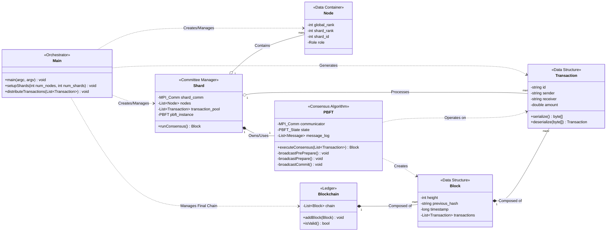

# UML Class Diagram

This document contains a UML class diagram representing the planned software architecture for the Parallelizing Blockchain Computations project. The diagram is based on the analysis of the `CONCEPT_MAP.md`, `IMPLEMENTATION_PLAN.md`, and `STRUCTURE.md` documents.

## Diagram Legend

-   **`Main`**: The main driver of the simulation. It initializes MPI, partitions nodes into shards, generates and distributes transactions, and orchestrates the overall workflow.
-   **`Node`**: A simple data class representing a single MPI process, holding its rank and role within the system.
-   **`Transaction`**: A data structure for a single transaction. It must be serializable to be sent over the network.
-   **`Block`**: A data structure containing a list of transactions and a header with metadata, forming one link in the blockchain.
-   **`Blockchain`**: Represents the final, global ledger, which is a collection of blocks aggregated from all shards.
-   **`Shard`**: Manages a committee of nodes. It holds the shard-specific MPI communicator, its transaction pool, and orchestrates the consensus process by using its `PBFT` instance.
-   **`PBFT`**: The core consensus engine. It runs within a shard's communicator to validate a set of transactions and produce a block.
-   **Relationships**:
    -   `..>` : Dependency (Uses)
    -   `o--` : Aggregation (Has-a)
    -   `*--` : Composition (Owns-a)
